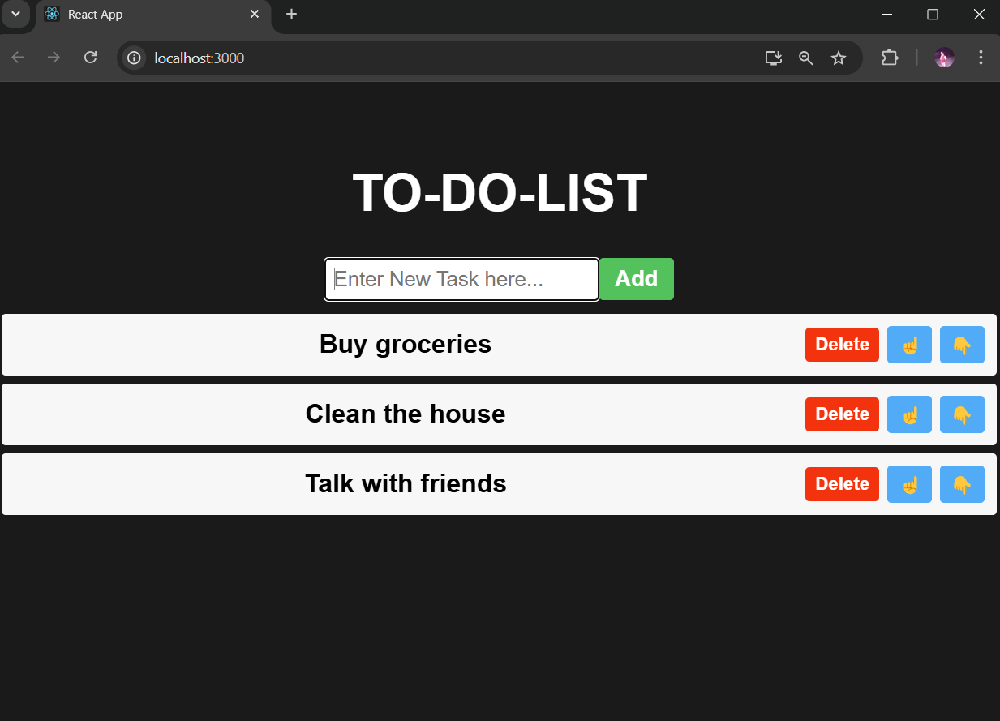

# 📝 React To-Do List App

A simple and responsive To-Do List application built using React. Users can add, delete, and mark tasks as complete. A perfect project to practice React fundamentals like hooks and component-based architecture.

--- 

## 📸 Screenshot



---

## 🚀 Features

- ✅ Add new tasks
- ❌ Delete tasks
- ✏️ Mark tasks as complete/incomplete
- 🔄 Real-time updates using React state
- 📱 Responsive design

---

## 🛠️ Technologies Used

- React (with Hooks)
- HTML5 & CSS3
- JavaScript (ES6+)

---

## 🧑‍💻 Getting Started

Follow these instructions to set up the project locally.

```bash
# 1. Clone the repository
git clone https://github.com/Venumadhavmule/To-Do-List-React.git

# 2. Navigate to project directory
cd To-Do-List-React

# 3. Install dependencies
npm install

# 4. Start the development server
npm start

# App will run on http://localhost:3000
